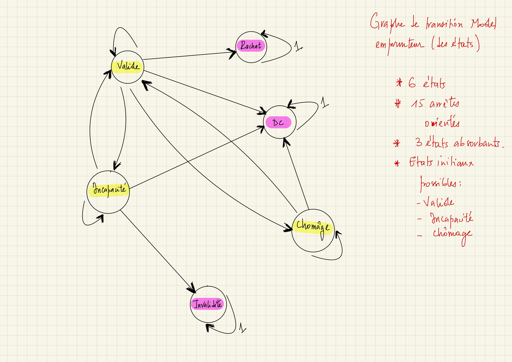

# Documentation : Modele assurance de l'emprunteur

## Introduction

Modele de projection des cash flow d'un effectif de models point d'un portefeuille assurance emprunteur. Le modele est developpé en programmation orientée objet avec des méthodes récursives (algorithmes récursifs) donc les différentes exécutions sont mises en cache avec le decorateur @functools.lru_cache du package functools de python. L'objectif de la mise en cache, des résultats d'éxécution des méthodes est d'accélérer les calculs (via la ***memoization***). 

## Projection des effectifs

La projection des effectifs est faite avec une chaine de markov.

### Les états

Modèle à 6 états : VALIDE, DC, CHOMAGE, INCAPACITE, INVALIDITE, LAPSE avec DC, INVALIDITE, LAPSE des états absorbants.

### Matrice des transitions

Elle représente les probabilités de passage entre états :

  |                | VALIDE | DC  | CHOMAGE | INCAPACITE | INVALIDITE | LAPSE |
  | -------------- | ------ | --- | ------- | ---------- | ---------- | ----- |
  | **VALIDE**     |        |     |         |            |            |       |
  | **DC**         |        |     |         |            |            |       |
  | **CHOMAGE**    |        |     |         |            |            |       |
  | **INCAPACITE** |        |     |         |            |            |       |
  | **INVALIDITE** |        |     |         |            |            |       |
  | **LAPSE**      |        |     |         |            |            |       |

  ### Représention graphique en chaine de markow

  ### Mecanisme de projection des effectifs

  Soit le Vecteur des effectifs à $t=0$; $V(0)$.
  exemple : $V(0) = 1 valide$

  | VALIDE | DC  | CHOMAGE | INCAPACITE | INVALIDITE | LAPSE |
  | ------ | --- | ------- | ---------- | ---------- | ----- |
  | 1      | 0   | 0       | 0          | 0          | 0     |

  Soit la matrice des transitions entre $t-1$ et $t$ : $M(t)$
  On a Le vecteur des effectifs à $t$ : $  V(t) = V(t-1) * M(t) $